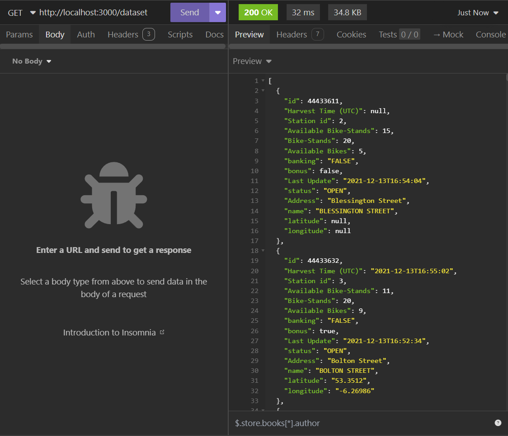
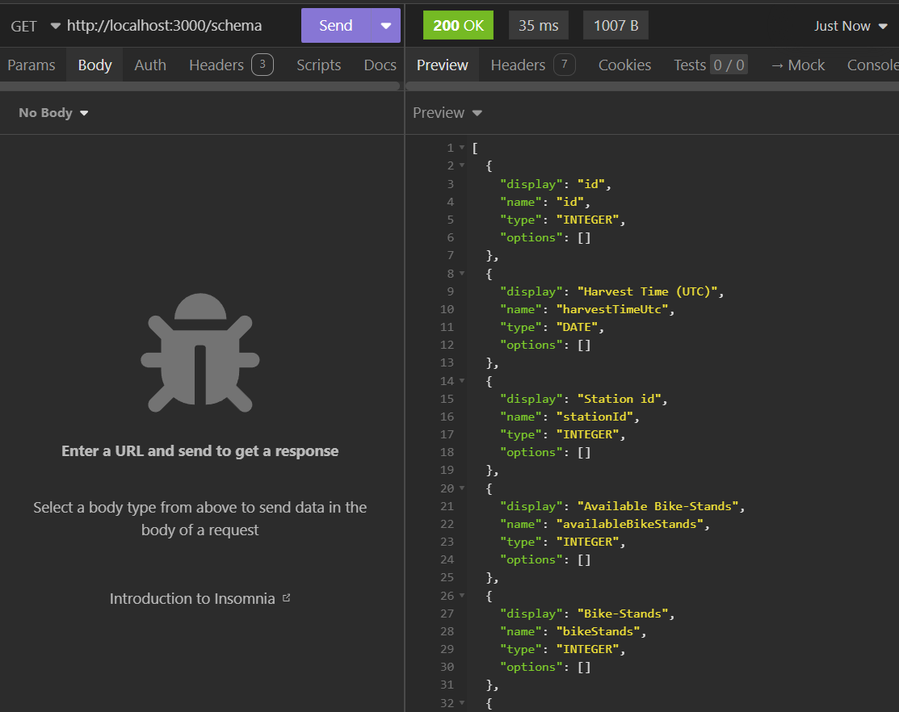
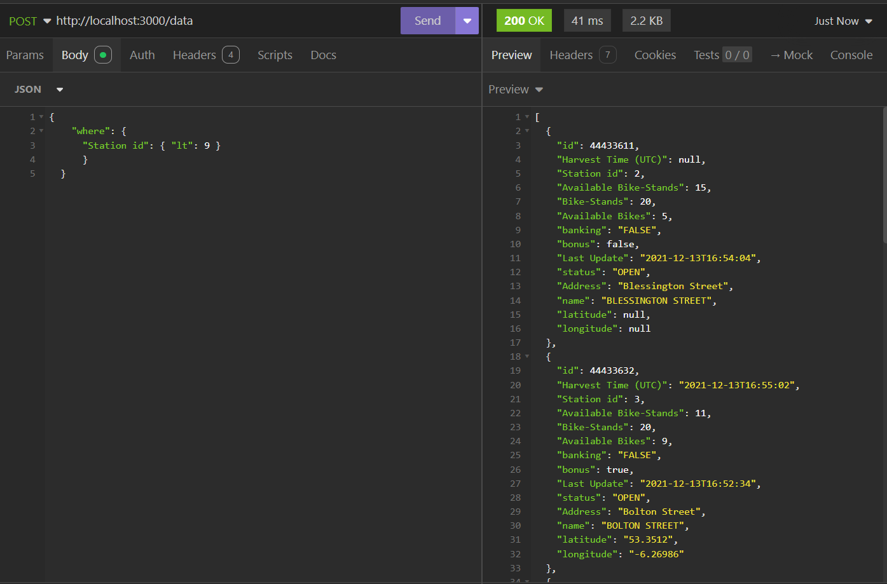
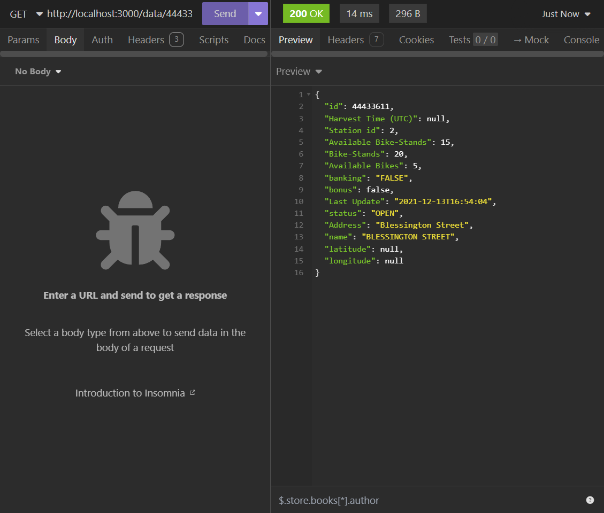

# Noloco-Exercise

ran following in terminal:
npm init -y           to get package.json file
npm install express   to install express framework
npm i -g nodemon      to get node monitor which constantly refreshes server so don't have to save and run over and over

The user can traverse the API using:

GET 'http://localhost:3000/dataset' to view the entire dataset

GET 'http://localhost:3000/schema' to view the schema of the dataset

POST 'http://localhost:3000/data' to filter the data given that the body is as follows:

{
    "where": {
      "Station id": { "gt": 9 }
			}
  }

GET 'http://localhost:3000/data/:id' to search for data that matches the inputted id value

If I had more time I would implement mapping so that the body could contain the schema version of the data name, e.g. "stationId". I could also add handling for NULL values.

HOW TO RUN:
run the command 'nodemon app.js' in terminal

